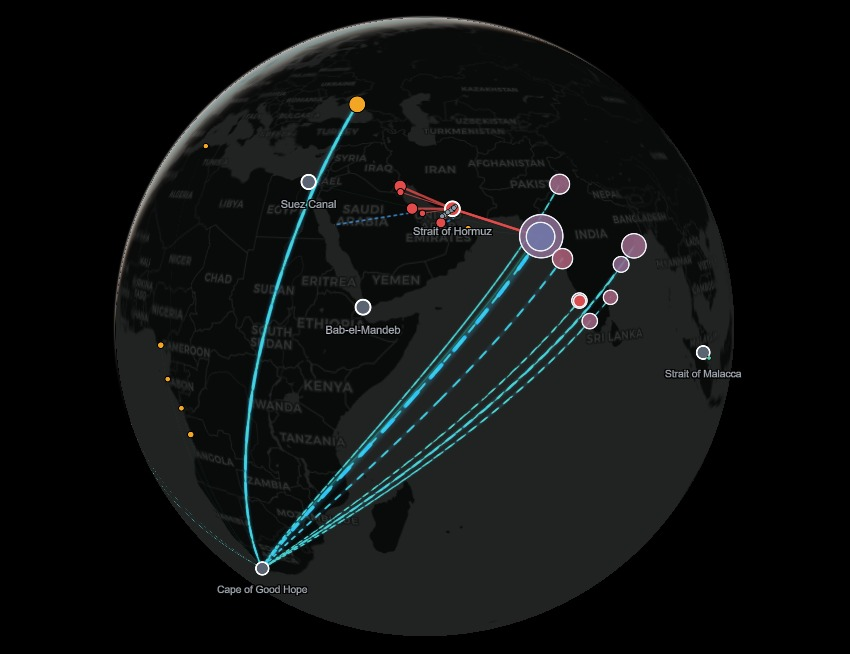

# KARNADHAR — India's Energy Supply-Chain Command Center

[](https://github.com/PureGenius369/Karnadhar/actions/workflows/ci.yml)


> *Karnadhar (कर्णधार, Sanskrit): the helmsman who steers the ship through the storm.*
> **From a 47-day crisis to a sub-second command.**

Built for the **ET AI Hackathon 2026 — Phase 2**, Problem #2 (*AI-Driven Energy Supply
Chain Resilience for Import-Dependent Economies*), by **Mann Sutariya** (Pandit Deendayal
Energy University).



India imports **88%** of its crude; **46%** of it transits the Strait of Hormuz — a number
this system **derives from official customs records**, not from a report. Strategic
reserves cover ~9.5 days (voluntary — India is outside the IEA's 90-day mandate). When a
chokepoint is threatened, economies without response intelligence take **47 days longer**
to stabilise supply (McKinsey). KARNADHAR compresses signal → executable recommendation
to **45 ms**.

---

## The wedge: crude oil is not fungible

Every generic "resilience dashboard" treats oil as one number: barrels. Reality: a
refinery is an engine tuned to a fuel. Three properties decide whether a barrel is
runnable — **API gravity** (light/heavy), **sulphur** (sweet/sour), and **asphaltene
content** (the SARA dimension, added on the guidance of Prof. U. K. Bhui, Petroleum
Engineering, PDEU). A deep-conversion coker like Jamnagar (Nelson 21.1) digests almost
anything but starves on ultra-light condensate; a simple refinery like Mumbai (Nelson 7)
cannot touch sour crude.

**The headline results (real DGCIS model, 10 refineries × 36 supplier grades):**

- **Hormuz closure** — the naive "oil is oil" plan is *infeasible for a grade
  reason*: its blend breaches Visakhapatnam's sulphur ceiling. KARNADHAR's
  two-stage LP re-sources the full 2,313 kb/d gap feasibly — and prices the
  hidden cost: the reroute ties up **+66 VLCC-equivalents** (the ton-mile effect
  a fungible view never sees).
- **Russia sanctioned** — naive sends **220 kb/d to refineries that physically
  cannot run it**; KARNADHAR: zero. Usable shortfall 220 → 0.
- **Hormuz + Russia (compound)** — naive *pretends* to fill the gap with 546 kb/d
  of un-runnable crude; counting only runnable barrels, KARNADHAR re-sources
  **504 kb/d more usable supply** and quantifies the honest remaining gap.
- **Shadow prices** — the LP's duals name the scarcest barrel (heavy Colombian
  coker feed, ~$4.2k/day per extra kb/d): a procurement priority list that is
  *derived, not opined*.
- On the curated stress-demo (`run_demo.py`), the wedge is worth **$3.15M/day of
  protected yield** (~$1.15bn/yr) — labelled as the demonstration model.

## What it is

```
signal  →  scenario  →  reroute  →  brief
GDELT news +    glass-box economic   grade-aware LP     executive memo —
live AIS ships  cascade + twin       over real DGCIS    LLM writes words,
                deficit              refinery diets     never numbers
```

- **Real data spine** — official DGCIS port-wise import records (May 2024–Apr 2026)
  give every refinery its *actual* crude diet, Hormuz exposure, and realized landed
  prices. PPAC capacities, public Nelson complexity, crude assay libraries.
- **Knowledge graph** — the supplier→route→chokepoint→refinery relationship model,
  materialised as a typed property graph with per-edge provenance
  (`python export_kg.py` → 50 nodes, 163 edges: SHIPS_VIA / SUPPLIES / THREATENS).
- **General disruption model** — block any chokepoint (Hormuz, Bab-el-Mandeb, Suez,
  Malacca, Cape) *and/or* sanction any supplier (e.g. Russia = 1,590 kb/d), in any
  combination.
- **Honest engine** — under compound shocks (Hormuz + OPEC squeeze) even the optimal
  reroute leaves demand unmet; KARNADHAR quantifies the gap instead of pretending.
- **Twin-deficit cascade** — the India-specific vulnerability (reviewed with Lydia
  Powell, Distinguished Fellow, ORF): a full closure adds ~$191bn/yr in USD outflow,
  blowing the current-account deficit from 1.2% → 6.1% of GDP. The binding constraint
  is the balance of payments, not the barrels.
- **Multi-commodity lens** — the framework generalised to 8 strategic imports (LNG,
  pharma APIs, semiconductors, edible oils, fertiliser, coking coal, solar PV) via a
  glass-box Import Vulnerability Index; the same disruption scored across every
  material (`python run_commodities.py` — Hormuz hits 53% of LNG, not just 46% of
  crude; Malacca is the pharma/electronics artery).
- **Decision layer, not just a dashboard** — every scenario ships with the LP's
  **shadow prices** (marginal value of one more kb/d of each scarce grade), the
  **usable-shortfall** honesty metric, and the **VLCC-equivalent tanker cost** of
  longer voyages.
- **War-room UI** — Next.js + MapLibre command center that draws **the optimizer's
  plan itself**: every LP allocation becomes an animated flow line — source →
  real corridor (Cape where that's the true voyage) → the exact refinery it
  feeds, width = kb/d, hover for the allocation. True **3D globe / 2D toggle**,
  real AIS vessels, bypass pipelines, a fully **interactive knowledge graph**
  (zoom/pan/drag), the multi-commodity lens, a live ticker tape, and scenario
  switching with the national plan re-solved in tens of milliseconds.

## Run it

```bash
# 1) Engine (Python 3.12)
pip install -r requirements.txt
python run_validate.py     # 50/50 automated checks — the proof
python run_real.py         # reroute on REAL DGCIS diets, all scenarios
python run_karnadhar.py    # end-to-end pipeline: signal → brief in ~45 ms

# 2) War-room (Node 20+)
python export_ui.py        # engine → frontend/public/karnadhar.json
cd frontend && npm install && npm run dev   # → http://localhost:3000
```

More runnables: `run_demo.py` (wedge head-to-head), `run_cascade.py` (economic cascade +
twin deficit), `run_signal.py` (GDELT 12-day-lead backtest), `run_ais.py` (live AIS),
`run_scenarios.py` (scenario library), `run_commodities.py` (multi-commodity screen),
`export_kg.py` (knowledge graph), `gen_deck_assets.py` (deck charts).

## Repository map

```
karnadhar/
├── engine/
│   ├── refdata.py       # DGCIS loader: port→refinery, country→grade/route, Nelson, asphaltene
│   ├── realmodel.py     # real refineries (configs DERIVED from diet + Nelson) + general Disruption
│   ├── realopt.py       # naive vs grade-aware LP on the real model
│   ├── data.py          # curated 15-grade / 7-refinery model (the original wedge demo)
│   ├── optimizer.py     # wedge optimizer + honest SPR evaluation
│   ├── cascade.py       # glass-box cascade incl. twin-deficit block
│   ├── scenarios.py     # scenario library
│   ├── orchestrator.py  # timed signal→scenario→reroute→brief chain
│   ├── briefing.py      # exec memo (template; Claude drop-in via ANTHROPIC_API_KEY)
│   ├── geo.py           # chokepoints, routes, coordinates
│   └── signals/
│       ├── gdelt.py     # live GDELT client + cache + labelled fallback
│       ├── agent.py     # risk scoring, alert rule, lead-time backtest
│       ├── ais.py       # live aisstream.io client (per-chokepoint bboxes)
│       └── extract.py   # headline classifier (keyword; Claude drop-in)
├── api/main.py          # FastAPI backend
├── frontend/            # Next.js 16 + MapLibre war-room
├── run_*.py             # runnable proofs (see above)
├── run_validate.py      # 50-check validation suite (exit-code gated; runs in CI)
├── export_ui.py         # engine → UI JSON
└── deliverables/        # pitch deck (KARNADHAR_Deck.pptx) + renders
```

## Brief coverage — every listed build area, mapped

| The brief's "what you may build" | KARNADHAR component |
|---|---|
| Geopolitical Risk Intelligence Agent (news, AIS, sanctions, price signals) | GDELT client + explainable alert rule (12-day backtested lead) · live AIS vessels · sanctions as a first-class disruption axis · realized landed prices from customs records |
| Disruption Scenario Modeller (Hormuz / OPEC+ / **Red Sea**) | 5-scenario library incl. **Red Sea suspension** — crude is Cape-insulated (54 kb/d) while edible oils take 18%: commodity-specific arteries |
| Adaptive Procurement Orchestrator (spot pricing, **tanker availability**, grade compatibility) | two-stage grade-aware LP + **shadow-price procurement priorities** + **VLCC ton-mile cost** (+66 tankers on Hormuz) |
| Strategic Reserve Optimisation Agent (**drawdown schedules**) | `engine/spr.py` — hold / bridge / ration scheduler with draw rate, depletion %, residual demand-management need |
| Supply Chain Digital Twin (geospatial what-if platform) | 3D-globe war-room + knowledge graph + bypass-pipeline mapping; every scenario re-solved live |

Suggested technologies: agentic multi-agent chain ✓ · geospatial (AIS, pipeline & port mapping) ✓ · predictive analytics & scenario simulation ✓ · knowledge graph (supplier-route-risk-refinery) ✓ · LLM signal extraction (keyword classifier with a key-gated Claude drop-in — words, never numbers) ◐ · RAG over intelligence corpora + sanctions-registry/port-congestion feeds → **roadmap** (documented, not claimed).

## Data provenance (honest by design)

**Reproducibility:** the raw DGCIS `.xls` files are government downloads and are
not redistributed here; the repo ships the **derived dataset**
(`engine/data/india_refinery_diets.json`, schema-versioned, with the derivation
code in `engine/refdata.py`). Every run — validation, exports, the war-room —
works from a fresh clone; anyone holding the raw files reproduces the dataset
bit-identically with `python -m engine.refdata`.

| Element | Status |
|---|---|
| Refinery diets, volumes, landed prices | **Real** — DGCIS official trade records |
| Refinery capacities | **Real** — PPAC |
| National import mix, Hormuz exposure | **Derived from the real records** (46%) |
| Crude assays (API/sulphur/asphaltene) | Public assay values per source grade |
| GDELT signal series | **Real** (cached June 2025); method identical live |
| AIS vessels | **Real live** where coverage exists (Malacca verified); Hormuz snapshot labelled — free feed has no Gulf receivers |
| Refinery processing limits | **Derived** from real diet + Nelson complexity; flagged for expert calibration (in progress with Prof. Bhui) |

## Expert review

- **Lydia Powell** — Distinguished Fellow, ORF Centre for Resources Management:
  twin-deficit framing, SPR-as-voluntary-insurance, sourcing-first policy sequence.
- **Prof. U. K. Bhui** — Petroleum Engineering, PDEU: wedge validated
  (*"That is — you are perfectly right"*), SARA/asphaltene dimension.

## License / secrets

No API keys are committed (`.env` is git-ignored). The aisstream key is free; the
engine runs fully without any key (labelled fallbacks).
